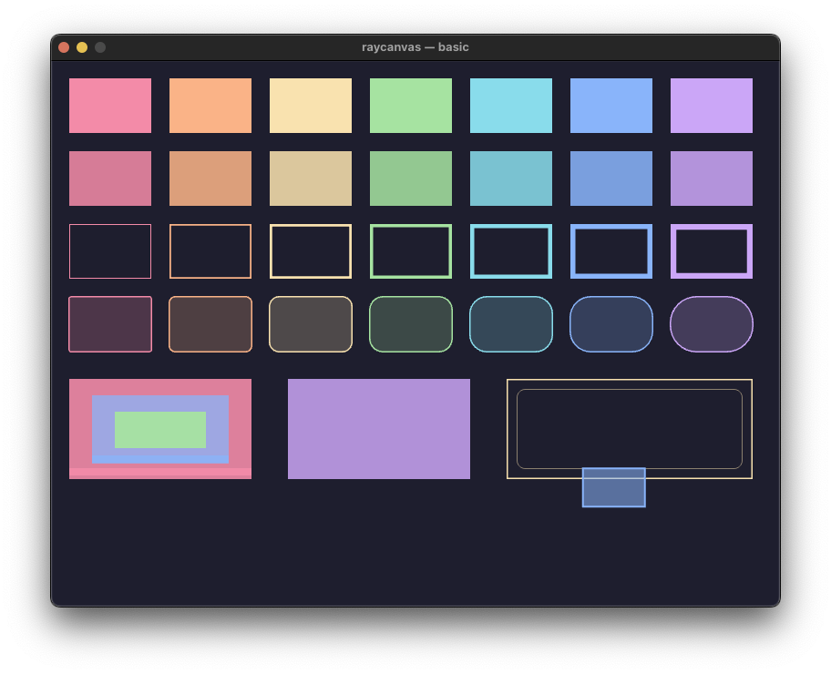
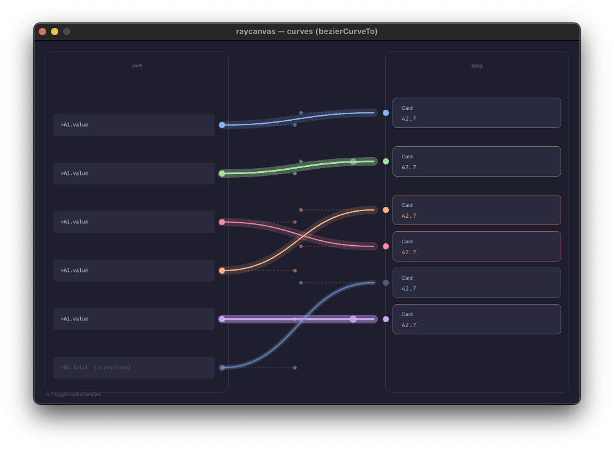
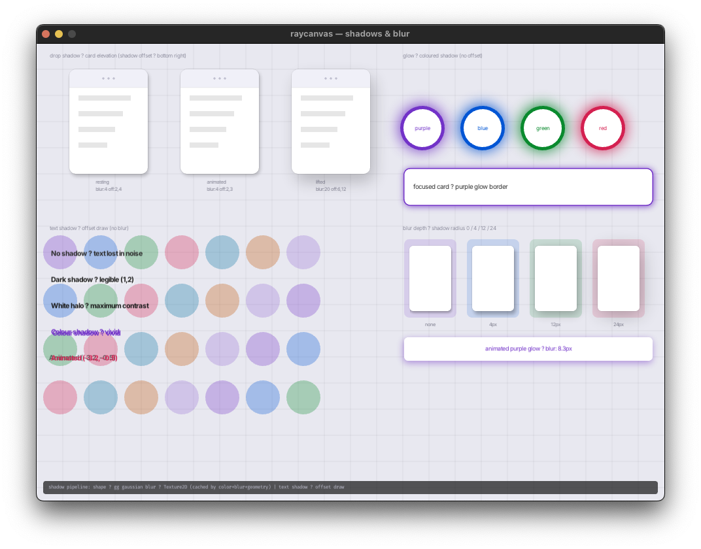
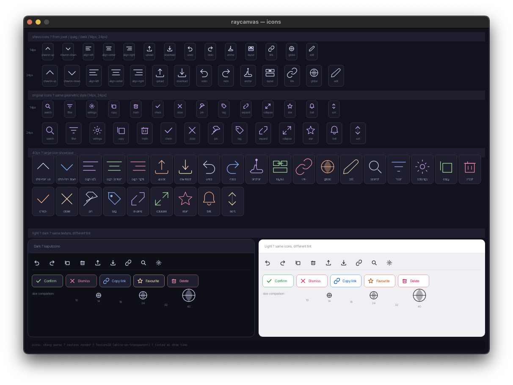

# raycanvas

**v0.2.4 — work in progress**

A Go package that mirrors the HTML5 `CanvasRenderingContext2D` API, backed by [raylib-go](https://github.com/gen2brain/raylib-go) for GPU rendering and [fogleman/gg](https://github.com/fogleman/gg) for CPU-side precision work (blur, anti-aliased curves, clip masks).

The goal is to let code written against the browser canvas API port to Go with minimal structural changes — same draw calls, same state model, same coordinate conventions.

---

## Requirements

- Go 1.22 or later
- raylib system dependencies (X11/Wayland on Linux, standard on macOS/Windows)
  - Ubuntu: `apt install libwayland-dev libxkbcommon-dev libx11-dev libxrandr-dev libxinerama-dev libxcursor-dev libxi-dev libgl1-mesa-dev`

---

## Quick start

```go
import (
    rl "github.com/gen2brain/raylib-go/raylib"
    rc "github.com/ha1tch/raycanvas"
    "github.com/ha1tch/raycanvas/fonts"
)

func main() {
    cache := rc.NewSharedCache()
    ctx   := rc.SetupWindow(960, 640, "My App", cache)
    defer rl.CloseWindow()
    defer cache.Unload()
    rl.SetTargetFPS(60)

    // Register TTF fonts after SetupWindow (GPU must be ready)
    fonts.Register(cache)  // embeds Inter + Fira Code

    for !rl.WindowShouldClose() {
        ctx.BeginFrame()

        ctx.SetFillStyle("#1e1e2e")
        ctx.FillRect(0, 0, 960, 640)

        ctx.SetShadowColor("rgba(0,0,0,0.5)")
        ctx.SetShadowBlur(12)
        ctx.SetShadowOffsetY(4)
        ctx.SetFillStyle("#cba6f7")
        ctx.FillRoundRect(100, 100, 200, 120, 9)
        ctx.SetShadowColor("transparent")
        ctx.SetShadowBlur(0)
        ctx.SetShadowOffsetY(0)

        ctx.SetFont("700 13px inter")
        ctx.SetFillStyle("#1e1e2e")
        ctx.SetTextAlign("center")
        ctx.SetTextBaseline("middle")
        ctx.FillText("Hello raycanvas", 200, 160)

        ctx.EndFrame()
    }
}
```

**Important:** `SetupWindow` must be called before any GPU resource allocation — font registration, icon registration, off-screen contexts. It calls `rl.SetConfigFlags(rl.FlagMsaa4xHint)` and `rl.InitWindow` in the correct order.

---

## API surface

### State

```go
ctx.Save()
ctx.Restore()
ctx.SetFillStyle(css string)
ctx.SetStrokeStyle(css string)
ctx.SetLineWidth(w float32)
ctx.SetGlobalAlpha(a float32)
ctx.SetFont(css string)           // e.g. "700 13px inter"
ctx.SetTextAlign(s string)        // "left" | "center" | "right"
ctx.SetTextBaseline(s string)     // "alphabetic" | "top" | "middle" | "bottom"
ctx.SetLineDash(segments []float32)
ctx.SetLineDashOffset(offset float32)
ctx.SetLineCap(s string)          // "butt" | "round" | "square"
ctx.SetLineJoin(s string)         // "miter" | "round" | "bevel"
ctx.SetImageSmoothingEnabled(b bool)
```

### Transform

```go
ctx.Translate(x, y float32)
ctx.Scale(x, y float32)
ctx.ResetTransform()
ctx.SetTransform(a, b, c, d, e, f float32)
```

### Shadow

```go
ctx.SetShadowColor(css string)
ctx.SetShadowBlur(b float32)
ctx.SetShadowOffsetX(x float32)
ctx.SetShadowOffsetY(y float32)
```

Shadow is applied to `FillRect`, `FillRoundRect`, `FillCircle`, and `FillText`. The blur pipeline renders the shape in [fogleman/gg](https://github.com/fogleman/gg), applies Gaussian blur, uploads to a `Texture2D`, and caches by `(color, blur, geometry)`. Text shadow is an offset draw (no blur), matching browser `text-shadow` behaviour.

### Path

```go
ctx.BeginPath()
ctx.ClosePath()
ctx.MoveTo(x, y float32)
ctx.LineTo(x, y float32)
ctx.Arc(x, y, r, startAngle, endAngle float32, anticlockwise bool)
ctx.ArcTo(x1, y1, x2, y2, r float32)
ctx.BezierCurveTo(cp1x, cp1y, cp2x, cp2y, x, y float32)
ctx.Rect(x, y, w, h float32)
ctx.RoundRect(x, y, w, h, r float32)
ctx.Fill()
ctx.Stroke()
ctx.Clip()
```

### Convenience primitives

These bypass tessellation and dispatch directly to raylib — use these in preference to the path API for common shapes:

```go
ctx.FillRect(x, y, w, h float32)
ctx.StrokeRect(x, y, w, h float32)
ctx.ClearRect(x, y, w, h float32)
ctx.FillRoundRect(x, y, w, h, r float32)
ctx.StrokeRoundRect(x, y, w, h, r float32)
ctx.FillRoundRectTop(x, y, w, h, r float32)  // rounded top corners only
ctx.StrokeRoundRectTop(x, y, w, h, r float32)
ctx.FillCircle(x, y, r float32)
ctx.StrokeCircle(x, y, r float32)
```

### Text

```go
ctx.FillText(text string, x, y float32)
ctx.MeasureText(text string) float32  // returns width
```

### Images and off-screen

```go
ctx.DrawImage(src rl.Texture2D, dx, dy float32)
ctx.DrawImageScaled(src rl.Texture2D, dst rl.Rectangle)
ctx.DrawImageCropped(src rl.Texture2D, srcRect, dst rl.Rectangle)
ctx.DrawImageOffscreen(src *rc.Context, dst rl.Rectangle)
ctx.DrawImageOffscreenCropped(src *rc.Context, srcRect, dst rl.Rectangle)

// Off-screen context (backed by RenderTexture2D)
offscreen := rc.NewOffscreen(width, height int32, cache *rc.SharedCache)
defer offscreen.Unload()
tex := offscreen.Texture()  // rl.Texture2D for use in DrawImage*
```

---

## Font system

Fonts are baked into atlas textures at specific pixel sizes. The atlas is selected at draw time so the font renders at exactly its baked resolution — no bilinear scaling.

```go
// Register a TTF font (after SetupWindow)
data, _ := os.ReadFile("Inter-Regular.ttf")
rc.RegisterFont(cache, "inter", 400, false, data, nil)
// sizes defaults to []float32{8, 9, 10, 11, 12, 13, 14}

// Use in SetFont
ctx.SetFont("400 12px inter")
ctx.SetFont("700 13px inter")
ctx.SetFont("13px fira")

// Debug registered families
fmt.Println(rc.RegisteredFamilies())
```

Family names are normalised: `"Fira Code"` → `"fira"`, `"Inter"` → `"inter"`, `"system-ui"` → `"inter"`. Font fallback: if the requested weight/style is not registered, the library tries the regular variant, then raylib's built-in 8×8 bitmap font.

The `examples/internal/fonts` package embeds Inter (400/500/600/700) and Fira Code (400/700) and can be imported directly:

```go
import "github.com/ha1tch/raycanvas/examples/internal/fonts"
fonts.Register(cache)
```

---

## Icons

SVG icons are rasterised at startup via [oksvg](https://github.com/srwiley/oksvg) + [rasterx](https://github.com/srwiley/rasterx), pre-baked white-on-transparent, and tinted at draw time:

```go
rc.RegisterIcon(cache, "close", closeSVGBytes, 14)
ctx.DrawIcon("close", x, y, 14, strokeColor)
```

---

## Clip

Rectangular clips use `rl.BeginScissorMode` with intersection tracking across `Save`/`Restore` levels (max observed depth: 3).

Rounded-rect clips use a corner-overdraw technique: content is drawn normally inside the scissor bounding box, then four quarter-circle caps in the background colour are painted over the corners on `Restore`. This requires knowing the background colour:

```go
ctx.SetMaskBackground("#1e1e2e")  // optional — falls back to current fillStyle
ctx.Save()
ctx.BeginPath()
ctx.RoundRect(x, y, w, h, 9)
ctx.Clip()
// ... draw clipped content ...
ctx.Restore()  // corner caps applied here
```

---

## Bézier curves

Cubic Bézier strokes are rendered anti-aliased via gg, cached as `Texture2D` keyed on `(p0, cp1, cp2, p1, lineWidth)`. Color and alpha are applied as a `DrawTexturePro` tint so animated opacity changes don't bust the cache.

**Limitation:** the Bézier cache is bounded at 1024 entries with FIFO eviction (no `UnloadTexture` on eviction — see Known Issues). If curve endpoints change continuously (draggable links), the cache fills quickly. LRU eviction is a planned improvement.

---

## Examples

Build and run any example with `make <name>`, or build all with `make build-examples`.

| Example | What it demonstrates |
|---|---|
| `basic` | `FillRect`, `StrokeRect`, `globalAlpha`, `save`/`restore`, `RoundRect` |


| `text` | Font variants, `MeasureText`, `textAlign`/`textBaseline`, word-wrap |
| `paths` | `Arc`, `ArcTo`, `LineDash`, nested clip, animated arc sweep |
| `curves` | `BezierCurveTo` with glow+stroke+pulse pattern |


| `grid` | Spreadsheet: zoom transform, nested clip, headers, selection |
| `zui` | Infinite canvas ZUI: pan/zoom, card drag, drop shadow, four themes |
| `shadows` | Drop shadow, coloured glow, text shadow, blur depth |



| `icons` | SVG icon registration: shevo icons, original icons, light/dark theme comparison |



---

## Known issues and limitations

### Path fill for complex polygons

The `Fill()` dispatch uses `DrawTriangleFan` with the polygon centroid as the fan centre. This works correctly for convex and star-convex polygons. Non-convex polygons (e.g. a star shape) will render incorrectly — some triangles will cover areas outside the intended fill. Proper ear-clipping triangulation is not yet implemented.

### roundRect clip uses corner overdraw

The rounded-rect clip implementation paints over the corners with the background colour rather than performing true alpha masking. This means:
- The background colour must be solid and known in advance (`SetMaskBackground` or current `fillStyle`)
- Content behind the clipped region must be a solid colour
- Semi-transparent backgrounds produce visible corner artefacts

A proper GPU-composited mask (via shader or CPU alpha blend) is the correct solution but is not yet implemented.

### Text shadow is offset-only

`SetShadowBlur` has no effect on `FillText`. Text shadow is rendered as a second draw at the shadow offset in the shadow colour. Browser `text-shadow` with blur requires rasterising the glyph outlines through gg, which is not yet implemented.

### Font baseline approximation

The alphabetic baseline correction (`0.75 * fontSize`) is empirically tuned for Inter and Fira Code at 8–14px. At larger or smaller sizes, or with other fonts, text may sit slightly higher or lower than the equivalent browser canvas rendering.

### Shadow cache eviction does not free VRAM

Evicted shadow textures are removed from the map but `UnloadTexture` is not called, because freeing the GPU texture ID causes raylib to reuse it immediately and stale references draw the wrong content. This is a known issue with no clean fix short of a reference-counted texture system. The cache cap is 1024 entries; shadow textures are small, so VRAM impact is minimal in practice.

### No gradient or pattern support

`createLinearGradient`, `createRadialGradient`, and `createPattern` are not implemented. The canvas API surface implemented matches the subset actually used in the target application.

### No quadratic curves

`quadraticCurveTo` is not implemented. Only cubic Bézier (`bezierCurveTo`) is supported.

---

## Dependencies

| Package | Role |
|---|---|
| `github.com/gen2brain/raylib-go/raylib` v0.60.0 | GPU rendering, window, input |
| `github.com/fogleman/gg` v1.3.0 | CPU precision rendering: shadow blur, Bézier AA, clip masks |
| `github.com/srwiley/oksvg` | SVG path parsing for icon rasterisation |
| `github.com/srwiley/rasterx` | SVG rasterisation backend |

---

## Build system

```
make help            — list all targets
make build           — type-check the library
make build-examples  — compile all examples to bin/
make basic           — build and run the basic example
make zui             — build and run the ZUI example
make release V=0.3.0 — cut a versioned release (checks CHANGELOG)
make patch V=0.2.2-patched01 — checkpoint zip, no CHANGELOG check
make package         — quick zip of current state
make clean           — remove bin/ and zips
```

---

## Licence

Copyright (c) 2026 haitch  
Licensed under the Apache License, Version 2.0  
https://www.apache.org/licenses/LICENSE-2.0
